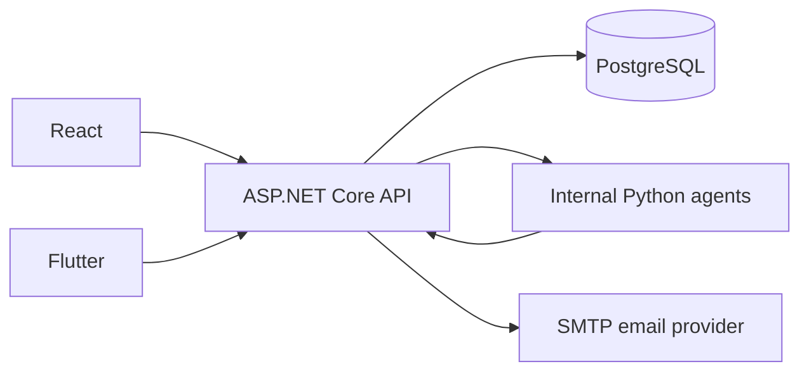

# BuildWise

Construction material requests, procurement, receiving, inspection and NCR resolution.

BuildWise is the SE3090 Assignment 1 integrated system. React and Flutter use the same ASP.NET Core API, PostgreSQL database, identity and business rules. Python agents are internal services called by the API; clients never call them directly.

Repository: https://github.com/IT24102414/build

## Business components

| Component | Recorded owner | Business operation |
|---|---|---|
| Material requests and approvals | Peiris DPSS | Validate demand and review requests |
| Suppliers, RFQs, quotations and procurement | Theebika (IT24102414) | Rank eligible offers and approve purchasing |
| Delivery and receiving | Ramya (IT24102513) | Reconcile confirmed orders and delivery discrepancies |
| Quality inspection and NCRs | Anoja | Inspect received quantities and resolve non-conformances |

Ownership names describe existing project assignments, not attribution of every maintenance change. Each student must supply their own contribution evidence and reflection.

## Stack and architecture

| Layer | Implementation |
|---|---|
| Public API | ASP.NET Core 8, EF Core, JWT authentication, role policies |
| Database | PostgreSQL, EF migrations, relational constraints and durable workflow state |
| Web | React, hooks, Context authentication, React Router, Vite |
| Mobile | Flutter/Dart, reusable widgets, local widget state, secure token storage |
| Agents | Python/FastAPI services; structured planning, allow-listed tools and deterministic validation |
| Device features | Camera/gallery evidence and local notifications |
| Third-party integration | Backend SMTP email; provider credentials required for real delivery |
| CI | GitHub Actions for .NET, Python, React and Flutter, with APK/build artifacts |



The assessed procurement sequence is request -> site review -> quotation entry -> planning/delegation -> supplier analysis -> deterministic validation -> authorized manager approval -> confirmed purchase order -> delivery -> quality inspection -> NCR when rejected quantity is positive. An agent recommendation cannot create a purchase order without human approval. Public execution summaries are persisted; hidden model reasoning and secrets are not evidence records.

## Roles and demo accounts

All seven roles can sign in to both clients. Menus and operation controls follow the shared role policies.

| Role | Demo email | Main responsibility |
|---|---|---|
| Procurement Officer | procurement.officer@buildwise.demo | RFQs, quotations, supplier analysis |
| Procurement Manager | procurement.manager@buildwise.demo | Procurement decisions and budgets |
| Site Engineer | site.engineer@buildwise.demo | Create and track own material requests |
| Site Officer | site.officer@buildwise.demo | Receive deliveries and track own requests |
| Site Manager | site.manager@buildwise.demo | Request approval and NCR review |
| Quality Inspector | quality.inspector@buildwise.demo | Inspections and quality risk analysis |
| Administrator | admin@buildwise.demo | Users, roles, health, audit and permitted operations |

Demo password: `Passw0rd!`. These are evaluation accounts, not production credentials. Suppliers are external contacts, not an eighth authenticated role.

## Local setup

Install .NET 8 SDK, PostgreSQL, Node/npm compatible with the web package, Python 3.12, and Flutter with Dart matching `pubspec.yaml`. Android builds additionally need Java 17 and the Android SDK.

1. Copy `.env.example` to `.env` and configure the database and JWT values. See [environment and agents](docs/environment_and_agents.md).
2. Install agent dependencies in an isolated virtual environment using `backend/agent_service/requirements.txt`.
3. Run `npm ci` in `web/buildwise-web` and `flutter pub get` in `mobile/buildwise_mobile`.
4. Apply database migrations: `dotnet ef database update --project backend/BuildWise.Api` after configuring the connection.
5. Start services using the script below. Consult [setup](docs/component2_setup_guide.md) for individual service commands.

```powershell
powershell.exe -NoProfile -ExecutionPolicy Bypass -File scripts/start-dev.ps1 -TimeoutSeconds 30
```

| Service | Local address |
|---|---|
| React | http://127.0.0.1:5173 |
| API | http://127.0.0.1:5078/api |
| Swagger | http://127.0.0.1:5078/swagger |
| Health | http://127.0.0.1:5078/health |
| Internal agents | 8001 quotation, 8002 request, 8003 delivery, 8004 quality |

Flutter web infers the API host. For a physical phone, pass a reachable server with `--dart-define=API_BASE_URL=http://YOUR_HOST:5078/api`. The Android emulator uses `10.0.2.2`. A localhost address on a phone points to the phone itself.

```powershell
cd mobile/buildwise_mobile
flutter run
# Browser build with locally bundled renderer resources:
flutter build web --release --no-web-resources-cdn --no-wasm-dry-run
```

SMTP setup and honest failed-email/retry behavior are documented in [email-setup.md](docs/email-setup.md).

## Validation and workflow rules

- Material names accept letters and numbers, with suggestions or typed names; required fields and unit-sensitive quantities are validated.
- Officers record quotations/run analysis; managers approve, reject or request revision. Revision requires a comment. Approval creates a confirmed PO.
- Inspections require a delivery, at least one item, positive inspected quantities, non-negative rejected quantities, accepted + rejected = inspected, received-quantity limits and delivery/material membership.
- Failed checklist items require notes; rejected quantities require a rejection reason. Evidence is limited to 10 files of at most 10 MB each.
- Zero rejected quantity creates no NCR; positive rejected quantity automatically creates an NCR.
- Resolved, Closed and AcceptedException require a resolution; invalid NCR transitions are rejected by the API.

## Verification

| Evidence | Latest verified result |
|---|---|
| .NET tests | 307 passed, 2026-10-05 |
| Python agent tests | 28 passed, 2026-10-05 |
| React tests | 163 passed, 2026-10-05 |
| Flutter tests | 149 passed; final authentication/shell follow-up 10 passed |
| Production builds | React and Flutter web passed |
| Seven-role browser review | 179 checks; found and fixed a React supplier-prefetch permission defect |
| Targeted final browser follow-up | 44 checks, no captured errors or page-width overflow |

The first sandboxed .NET run failed because Windows EventLog access was denied; the approved rerun passed. React lint exits successfully with existing warnings. Local browser evidence is read-only and does not prove every live write journey or physical-device behavior.

```powershell
dotnet test backend/BuildWise.Api.Tests/BuildWise.Api.Tests.csproj
# In backend/agent_service: python -m pytest -q
# In web/buildwise-web: npm test -- --run; npm run lint; npm run build
# In mobile/buildwise_mobile: flutter analyze; flutter test
```

Additional live workflow, authorization and performance scripts are indexed in [docs](docs/README.md). Workflow scripts can create demonstration records; use a demo database.

## Submission and deployment

[Submission readiness](docs/submission-readiness.md) maps the supplied assignment requirements to source/evidence and outstanding items. [Consolidated report draft](docs/submission-report.md) ([PDF](docs/SE3090_G07_Consolidated_Report_Draft.pdf)) provides the group report and clearly marked individual sections. [ADRs](docs/adr) cover orchestration, durable state, React/Flutter state management, deployment and external suppliers.

Deployment URLs, PostgreSQL hosting evidence, the 10-minute video, a current installed APK demonstration, member IDs/signatures and student-authored reflections must be supplied by the team. Local success is not evidence of public deployment or a passing GitHub Actions run. The existing root APK is historical; use the APK artifact from CI for the updated revision and verify it on a device.

The assignment requires evaluator access until at least 2026-10-21. This update is dated 2026-10-05; it does not claim a submission before the 2026-09-30 deadline.

AI-assisted development is disclosed in [maintenance log](docs/reports/2026-10-05-codex-maintenance-log.md). Individual reflections and signatures must be written by the students. No external coding assistant may be used during the final demonstration/viva; run the application's own agent subsystem.

Local performance evidence: [JSON](docs/performance-results-2026-10-05.json). All five scenarios had 100% successful responses, but quotation-agent p95 missed its local latency target. This remains an improvement item, not a claimed pass.
